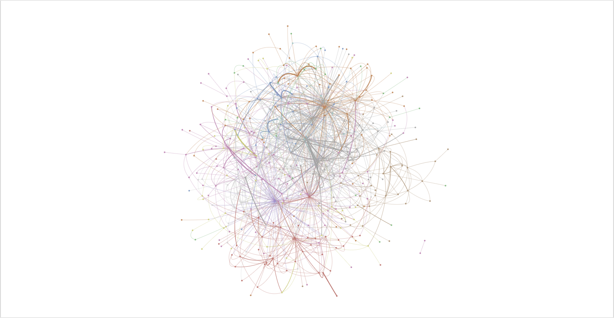

# Visualizing Company Mentions

Isaac Liu

This subproject of the [Stat-222 Textual Analysis and Financial Statements Project](https://github.com/ijyliu/Stat-222-Project-Isaac/tree/main) creates an interactive HTML/Javascript visualization (full [here](https://sites.google.com/view/isaac-liu/demos/corporate-network/full-network?authuser=0), 50% sample [here](https://sites.google.com/view/isaac-liu/demos/corporate-network/50-node-sample?authuser=0)) of the network of corporations implied by mentions in quarterly earnings calls.

I first used spaCy's transformer-based Named Entity Recognition on GPU to extract *organization* entities mentioned in each call. After performing some basic harmonization steps and experimenting with trigram and other fuzzy match algorithms, I was able to match each mention to another company and sector. After aggregating mention counts at the level of the mentioned and mentioning firms, I was able to construct the interactive visualization with NetworkX and PyVis by connecting companies based on there ever being a mention in either direction. A separate call-level network with some modifications was used the train the Graph Convolutional Network in the main part of the project. A Doc2Vec, cosine similarity network was also considered but was ultimately less intuitive.

Code for this subproject is divided among [NER](https://github.com/ijyliu/Stat-222-Project-Isaac/tree/main/Code/NLP%20Feature%20Construction/NER%20Firm%20Mentions) and [Visualization](https://github.com/ijyliu/Stat-222-Project-Isaac/tree/main/Code/Exploratory%20Data%20Analysis/Company%20Mentions%20Network) folders.

## Technologies (not exhaustive!)

- Python
  - spaCy
  - fuzzy_match
  - NetworkX, PyVis
  - Seaborn, Matplotlib
  - Pandas
