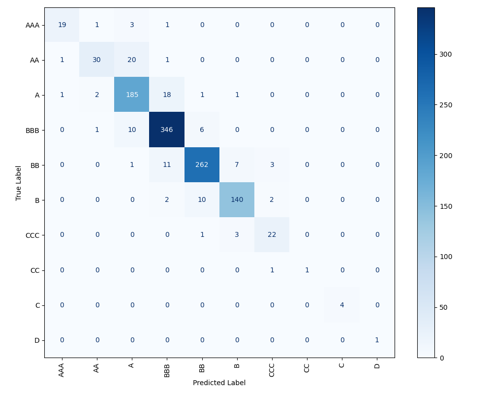

# Stat-222-Project

Textual Analysis of Financial Statements

Zhengxing Cheng, Owen Lin, Isaac Liu, Sean Zhou

In this work, we introduce features gleaned from the deployment of advanced natural language processing techniques on the text of company earnings calls to a fine-grained credit rating prediction task. Features capturing call readability, transparency, and engagement join classical and pre-trained language model representations of sentiment and traditional tabular variables as inputs to a variety of supervised machine learning techniques for classification from logistic regression to tree-based methods. We also made use of named entity recognition to extract mentions of other companies from earnings calls, and used the network of mentions along with our features to train a GraphSAGE Graph Convolutional Neural Network. By adding our NLP features, we were able to improve the performance of our best performing XGBoost model by 14% to over 90%, outperforming prior work in the literature, even with our more difficult task of predicting individual ratings rather than investment grade status.

A full writeup of the project (from Isaac) can be found [here](https://github.com/ijyliu/Stat-222-Project-Isaac/blob/main/Writeups/Writeup%202.pdf). An interactive visualization of the network for firms can be found [here](https://sites.google.com/view/isaac-liu/demos/corporate-network/full-network?authuser=0) (full) and [here](https://sites.google.com/view/isaac-liu/demos/corporate-network/50-node-sample?authuser=0) (50% sample). A Docker implementation of a replication sample can be found [here](https://github.com/ijyliu/Stat-222-Project-Isaac/tree/main/Docker%20Replication%20Sample), or you may use the conda environment and notebook `Replication Sample.ipynb` in [this](https://github.com/ijyliu/Stat-222-Project-Isaac/tree/main/Code/Replication%20Sample) folder.

## Technologies (not exhaustive!)

- Python
  - Deep Graph Library
  - spaCy
  - NLTK
  - Transformers
  - Sklearn
  - SciPy
  - XGBoost
  - SMOTE
  - AutoGluon
  - statsmodels
  - Networkx, PyVis
  - Dask
  - Pandas
  - PyArrow/Parquet
  - Conda
- Bash and the Slurm Cluster Resource Manager for CPUs and GPUs
- Docker
